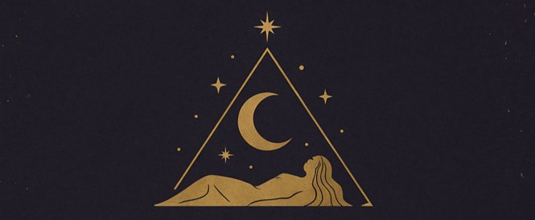

<h1 align="center">
  
   DreamWalker 
  <h3 align="center">Lumânări Parfumate</h3>
</h1>

Creez lumânări parfumate din ceară de soia eco si uleiuri parfumate atent alese, fără coloranti sau aditivi. 
Am ales cu grijă fiecare combinatie de arome, ca să te poarte într-o experientă multisenzorială. 
Incearca o lumanare-călătorie prin parfumuri si simboluri, în care fiecare aromă te cheamă să descoperi o parte din tine.

**Pentru a comanda**: completează formularul apăsând butonul de la finalul paginii. 

___
<h3 align="left">
  1. Linden Spirit
</h3>

  Un parfum luminos si senin, care aminteste de serile linistite de vară, când mirosul florilor de tei se împleteste cu iarba proaspăt cosită. Notele de santal adaugă profunzime si stabilitate, creând un acord calm, aproape meditational.

  <h2></h2>
  <strong>Aroma:</strong> <em>proaspătă, florală, linistitoare.</em>
  <h2></h2>

___
<h3 align="right">
  2. Obsidian Fire
</h3>

  O esentă misterioasă si intensă, unde fumul sacru de Palo Santo dansează alături de notele adânci de oud. Un strop de piper negru aprinde compozitia, evocând forta brută a focului ascuns în piatra de obsidian.

  <h2></h2>
  <strong>Aroma:</strong> <em>lemnoasă, răsinoasă, enigmatică.</em>
  <h2></h2>

___
<h3 align="left">
  3. Rose Veil
</h3>

  Un voal catifelat de trandafir se ridică peste tonurile senzuale de oud, aducând noblete si rafinament. Moscul alb învăluie totul într-o delicatete intimă, ca o atingere invizibilă care rămâne pe piele.

  <h2></h2>
  <strong>Aroma:</strong> <em>florală, senzuală, sofisticată.</em>
  <h2></h2>

___
<h3 align="right">
  4. Citrus Noir
</h3>

  Un contrast surprinzător între prospetimea vibrantă a portocalei si intensitatea condimentată a piperului negru. Notele de santal asază totul într-o bază caldă si misterioasă, ca un joc între lumină si umbră.

  <h2></h2>
  <strong>Aroma:</strong> <em>citrică, condimentată, elegantă.</em>
  <h2></h2>

___
<h3 align="left">
  5. Spicy Bloom
</h3>

  Un buchet exotic de ylang-ylang înfloreste într-un vârtej condimentat de piper negru, potolit de dulceata catifelată a vaniliei. O explozie florală si senzuală, care lasă o urmă îndrăzneată si memorabilă.

  <h2></h2>
  <strong>Aroma:</strong> <em>florală, exotică, seducătoare.</em>
  <h2></h2>

___
<h3 align="right">
  6. Silky Ashes
</h3>

  Notele calde de ambră si santal indian se topesc într-o catifelare dulce de migdale si vanilie. Este o aromă mătăsoasă, profundă, ca o amintire de jar mocnit ce continuă să încălzească mult timp după ce flacăra s-a stins.

  <h2></h2>
  <strong>Aroma:</strong> <em>balsamică, gurmandă, catifelată.</em>
  <h2></h2>

___

  <a href="https://docs.google.com/forms/d/e/1FAIpQLSfW3_LAiMWHq75s65nGINn58RrpkI2SoqbXHdaD2o0Ljw74sA/viewform?usp=header">
    
     (click aici pentru a comanda dacă butonul nu se încarcă)
  </a>

